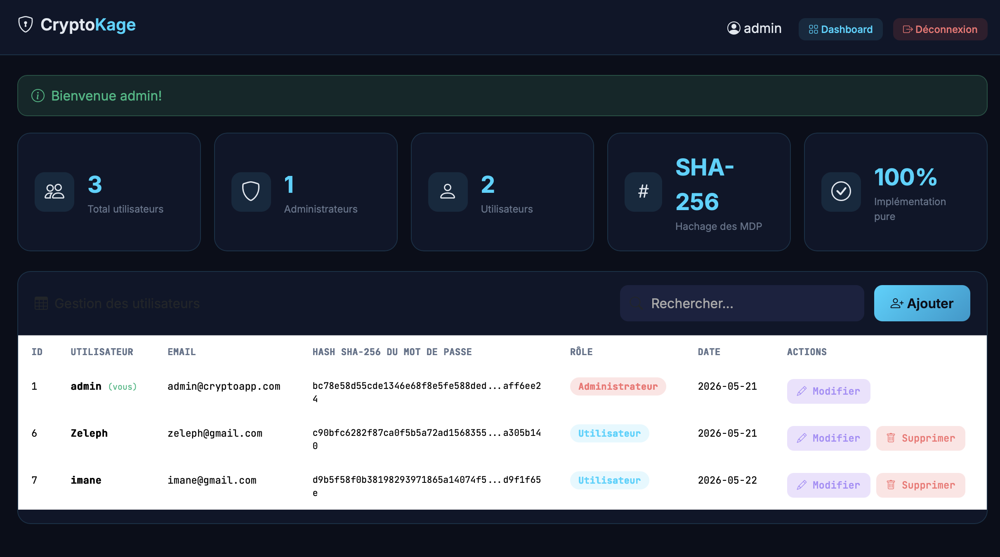
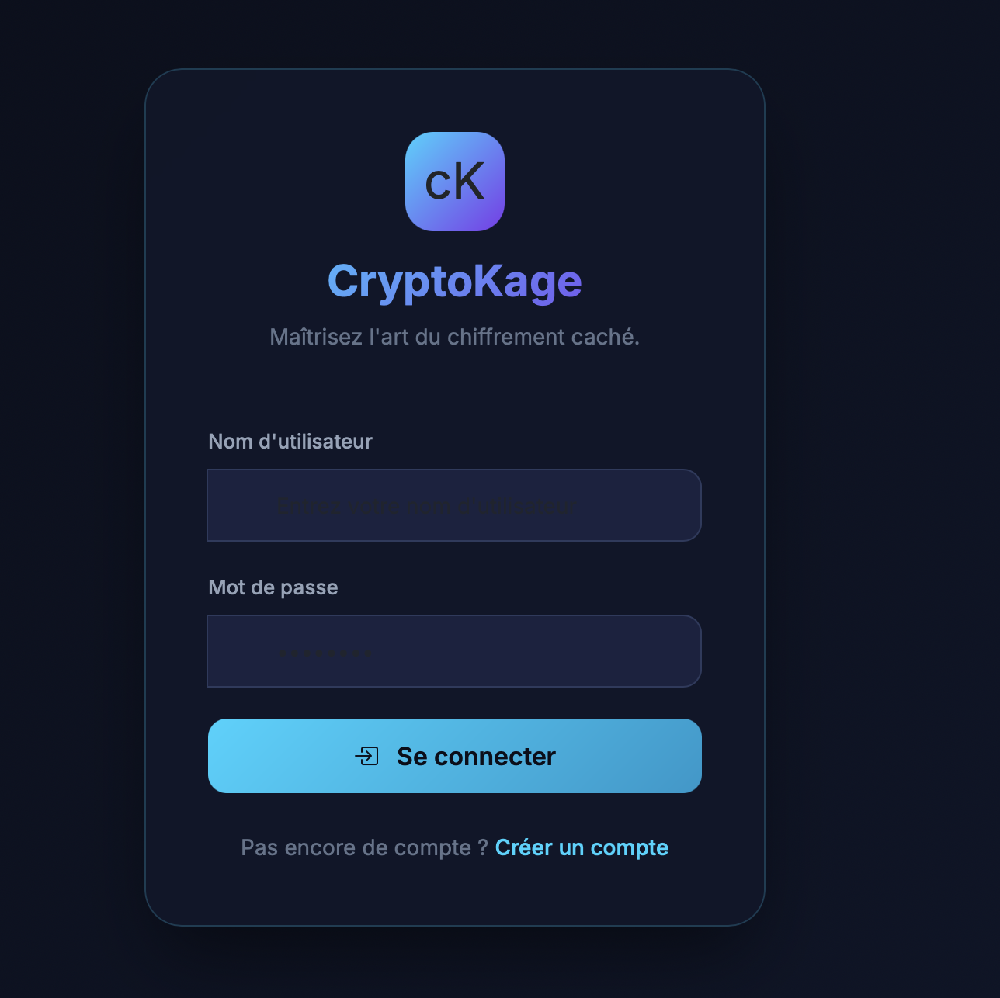
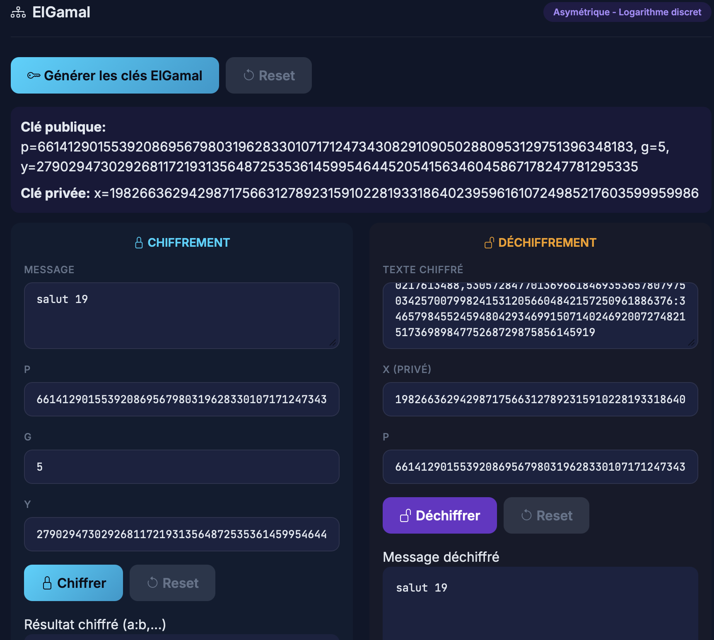

# CryptoKage
### Application de Cryptographie — Implémentation Pure en Python

> Chaque algorithme est implémenté manuellement en Python pur, sans aucune bibliothèque cryptographique externe.

---

## Description

CryptoKage est une application web complète dédiée à la cryptographie pédagogique. Elle permet de :

- Chiffrer et déchiffrer des messages avec une vingtaine d'algorithmes classiques et modernes
- Générer des clés asymétriques (RSA, ElGamal, EC-ElGamal)
- Calculer des empreintes numériques (SHA-1, SHA-256)
- Administrer les utilisateurs via une interface dédiée

---

## Algorithmes implémentés

### Cryptographie symétrique

| Algorithme | Description |
|------------|-------------|
| Code César | Décalage alphabétique de 1 à 25 positions |
| Vigenère | Chiffrement polyalphabétique par mot-clé |
| Vernam (OTP) | Masque jetable basé sur le XOR |
| RC4 | Chiffrement par flot de Rivest |
| DES | Standard historique en modes ECB, CBC, CFB |
| AES-128 | Standard actuel — 10 rondes, SubBytes, ShiftRows, MixColumns |

### Cryptographie asymétrique

| Algorithme | Principe mathématique |
|------------|----------------------|
| RSA | Factorisation de grands nombres |
| ElGamal | Logarithme discret |
| EC-ElGamal | Courbe elliptique (secp256k1) |

### Fonctions de hachage

| Algorithme | Taille de sortie |
|------------|------------------|
| SHA-1 | 160 bits |
| SHA-256 | 256 bits |

---

## Aperçu






## Architecture du projet

```
CryptoKage/
├── app.py                    # Application Flask (routes, sessions, auth)
├── crypto_algorithms.py      # Cœur des algorithmes (implémentation pure)
├── templates/
│   ├── login.html            # Authentification
│   ├── register.html         # Inscription
│   ├── dashboard.html        # Interface principale
│   └── admin_dashboard.html  # Administration
└── cryptoapp.db              # Base de données SQLite
```

---

## Installation

**Prérequis :** Python 3.9+

```bash
# 1. Cloner le dépôt
git clone https://github.com/Aboubakar235/CryptoKage.git
cd CryptoKage

# 2. Installer les dépendances
pip install flask

# 3. Lancer l'application
python app.py
```

Ouvrir ensuite [http://127.0.0.1:5000](http://127.0.0.1:5000) dans le navigateur.

### Accès par défaut

| Rôle | Identifiant | Mot de passe |
|------|-------------|--------------|
| Administrateur | `admin` | `Admin@1234` |
| Utilisateur | *(à créer)* | *(à définir)* |

---

## Fonctionnalités

### Utilisateur standard
- Connexion et inscription
- Chiffrement / déchiffrement pour chaque algorithme
- Génération de clés asymétriques
- Copie des résultats dans le presse-papiers
- Changement de mot de passe

### Administrateur
- Consultation de tous les comptes utilisateurs
- Création, modification et suppression de comptes
- Visualisation des hashs SHA-256 des mots de passe
- Recherche d'utilisateurs

---

## Particularités techniques

- Aucune bibliothèque cryptographique externe — tout est codé à la main
- Hachage des mots de passe avec SHA-256 pur
- Sessions Flask gérées manuellement
- Interface responsive avec Bootstrap 5
- Police JetBrains Mono pour l'affichage des clés et hashs

---

## Avertissement pédagogique

Ce projet est destiné à l'apprentissage. Plusieurs algorithmes sont historiquement compromis et **ne doivent pas être utilisés en production** :

| Algorithme | Raison |
|------------|--------|
| DES | Obsolète depuis 2000 |
| RC4 | Vulnérable aux attaques par biais |
| RSA 512 bits | Factorisable en temps raisonnable |
| SHA-1 | Cassé cryptographiquement |

En production, privilégier **AES-256**, **RSA-2048** et **SHA-256**.

---

## Évolutions possibles

- [ ] Ajouter HTTPS (certificat Let's Encrypt)
- [ ] Remplacer SHA-256 par bcrypt pour les mots de passe
- [ ] Passer RSA à 2048 bits minimum
- [ ] Ajouter l'authentification à deux facteurs (2FA)
- [ ] Dockeriser l'application
- [ ] Ajouter des tests unitaires (pytest)

---

## Auteur

**Aboubakar Abdelaziz**  
École Mohammadia d'Ingénieurs (EMI) — Rabat

[Rapport du projet](projet_crypto.pdf)